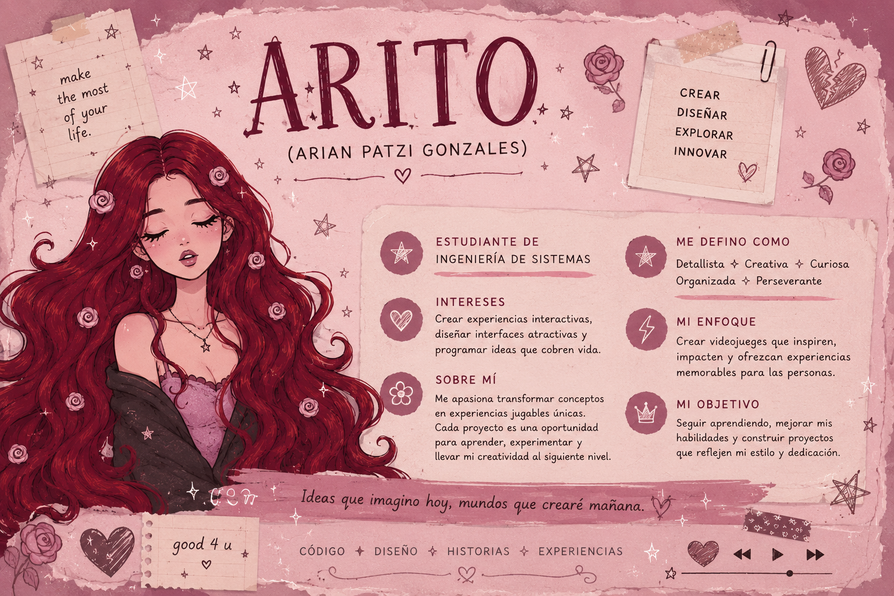
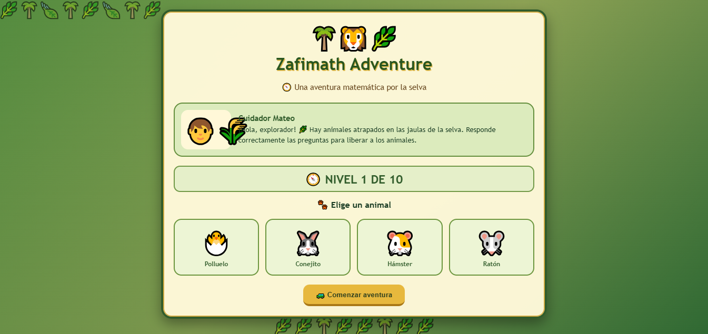
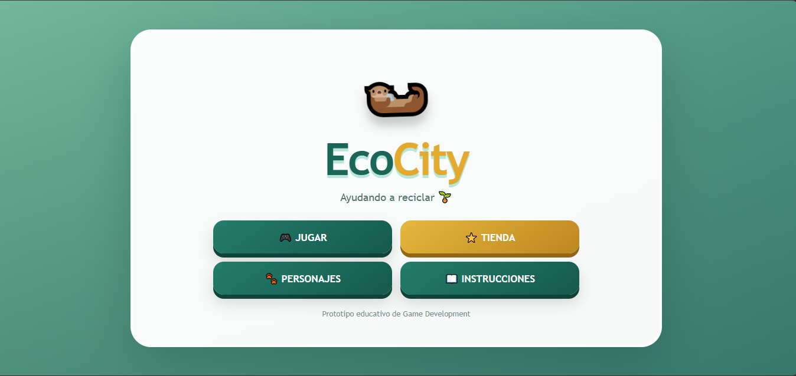
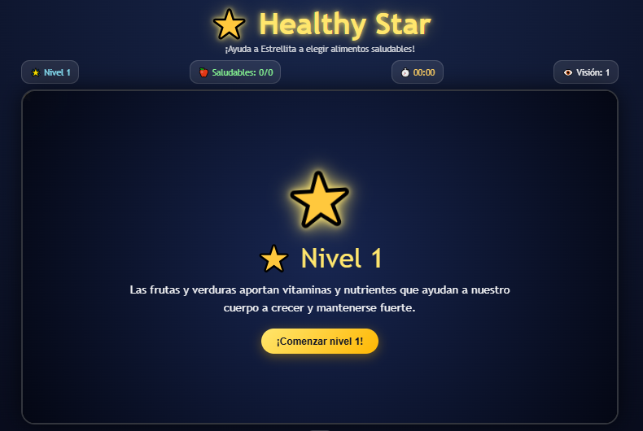
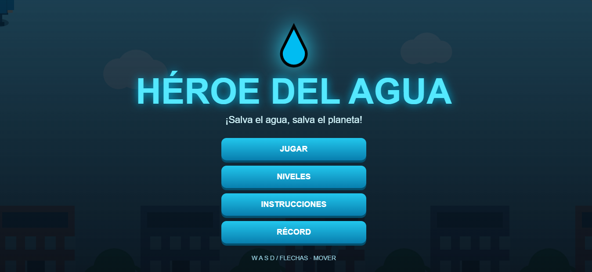
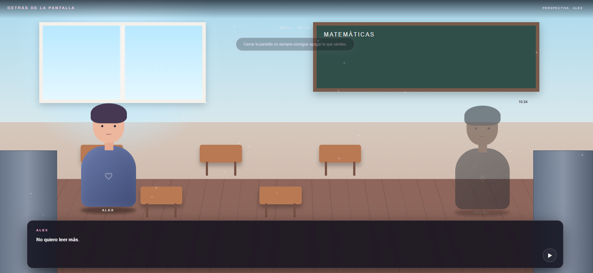
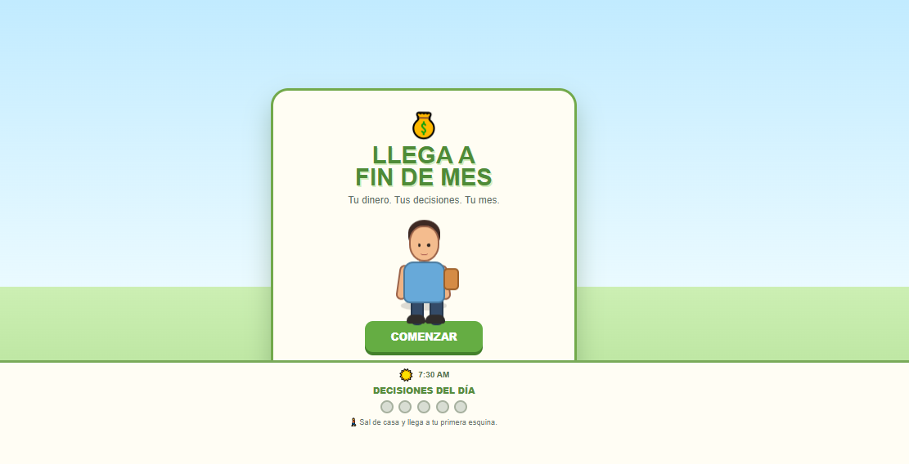

<!-- ✦ BANNER PRINCIPAL ✦ -->

  

˚｡⋆ ✦ ⋆｡˚

✦ GAME DEVELOPER ✦

˚｡⋆ un espacio para crear, diseñar y explorar ⋆｡˚

Arito · Estudiante de Ingeniería de Sistemas

Me interesa crear, diseñar y programar experiencias interactivas, combinando creatividad y tecnología para transformar ideas en proyectos que puedan disfrutarse y explorarse.

Me considero una persona detallista, creativa, curiosa, organizada y perseverante. Cada proyecto es una oportunidad para aprender, experimentar y seguir desarrollando nuevas habilidades.

✦ ˚｡⋆ ♡ ⋆｡˚ ✦

✦˚｡⋆ Galería de videojuegos ⋆｡˚✦

Una colección de experiencias interactivas creadas durante el proceso de aprendizaje en Game Development.

Cada proyecto representa una temática diferente y una oportunidad para experimentar con programación, diseño, creatividad y diferentes formas de interacción con el jugador.

˚｡⋆♡⋆｡˚

✦ 01 · Zafimath Adventure ✦

  

♡ Matemáticas

Zafimath Adventure es un videojuego educativo enfocado en las matemáticas. El jugador debe superar diferentes desafíos y resolver actividades relacionadas con operaciones matemáticas para avanzar.

✦ Género: Educativo · Aventura · Desafíos

✦ Tecnología: HTML · CSS · JavaScript

✦ Proyecto: [Ver proyecto](./juego-1-zafimath/)

✦ Jugar: [Jugar Zafimath Adventure](https://aritozs673-maker.github.io/Game-Developer/juego-1-zafimath/)

˚｡⋆ ───────────────────── ⋆｡˚

✦ 02 · EcoCity ✦

  

♡ Reciclaje y medio ambiente

EcoCity es un videojuego educativo relacionado con el reciclaje y el cuidado del medio ambiente. El jugador debe reconocer diferentes residuos y colocarlos correctamente para ayudar a mantener limpia la ciudad.

✦ Género: Educativo · Casual · Medio ambiente

✦ Tecnología: HTML · CSS · JavaScript

✦ Proyecto: [Ver proyecto](./juego-2-ecocity/)

✦ Jugar: [Jugar EcoCity](https://aritozs673-maker.github.io/Game-Developer/juego-2-ecocity/)

˚｡⋆ ───────────────────── ⋆｡˚

✦ 03 · Healthy Star ✦

  

♡ Hábitos saludables

Healthy Star es un videojuego enfocado en los hábitos saludables mediante una experiencia interactiva y entretenida.

El jugador debe interactuar con diferentes elementos y superar los desafíos relacionados con el cuidado y bienestar personal.

✦ Género: Educativo · Casual · Interactivo

✦ Tecnología: HTML · CSS · JavaScript

✦ Proyecto: [Ver proyecto](./juego-3-healthy-star/)

✦ Jugar: [Jugar Healthy Star](https://aritozs673-maker.github.io/Game-Developer/juego-3-healthy-star)

˚｡⋆ ───────────────────── ⋆｡˚

✦ 04 · Héroe del Agua ✦

  

♡ Ahorro y cuidado del agua

Héroe del Agua es un videojuego en el que el jugador se convierte en un héroe encargado de proteger el agua y superar diferentes desafíos.

El proyecto fue diseñado tomando en cuenta un Player Persona dirigido a jóvenes, buscando promover el ahorro responsable del agua mediante una experiencia dinámica.

✦ Género: Educativo · Arcade · Aventura

✦ Tecnología: HTML · CSS · JavaScript

✦ Concepto: Player Persona

✦ Proyecto: [Ver proyecto](./juego-4-heroe-del-agua/)

✦ Jugar: [Jugar Héroe del Agua](https://aritozs673-maker.github.io/Game-Developer/juego-4-heroe-del-agua/)

˚｡⋆ ───────────────────── ⋆｡˚

✦ 05 · Cyberbullying ✦

  

♡ Cyberbullying y toma de decisiones

Videojuego de rol basado en diferentes situaciones relacionadas con el cyberbullying.

El jugador debe enfrentarse a situaciones dentro de entornos digitales y tomar decisiones, observando las posibles consecuencias de sus acciones.

✦ Género: Rol · Educativo · Toma de decisiones

✦ Tecnología: HTML · CSS · JavaScript

✦ Proyecto: [Ver proyecto](./juego-5-cyberbullying/)

✦ Jugar: [Jugar Cyberbullying](https://aritozs673-maker.github.io/Game-Developer/juego-5-cyberbullying/)

˚｡⋆ ───────────────────── ⋆｡˚

✦ 06 · Llega a Fin de Mes ✦

  

♡ Ahorro y administración del dinero

Llega a Fin de Mes es un videojuego relacionado con la administración del dinero y la toma de decisiones económicas.

El jugador debe administrar sus recursos y tomar diferentes decisiones para intentar llegar correctamente al final del mes.

✦ Género: Simulación · Estrategia · Educativo

✦ Tecnología: HTML · CSS · JavaScript

✦ Proyecto: [Ver proyecto](./juego-6-fin-de-mes/)

✦ Jugar: [Jugar Llega a Fin de Mes](https://aritozs673-maker.github.io/Game-Developer/juego-6-fin-de-mes/)

˚｡⋆ ───────────────────── ⋆｡˚

# ✦˚｡⋆ La colección ⋆｡˚✦

♡ 01 · Zafimath Adventure  
♡ 02 · EcoCity  
♡ 03 · Healthy Star  
♡ 04 · Héroe del Agua  
♡ 05 · Cyberbullying  
♡ 06 · Llega a Fin de Mes  

✦ Cada videojuego representa una temática, una idea y una experiencia diferente.

˚｡⋆ ✦ ⋆｡˚
