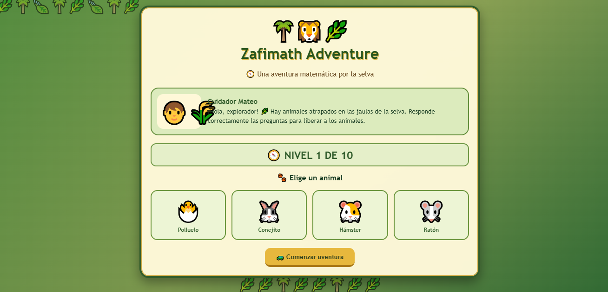
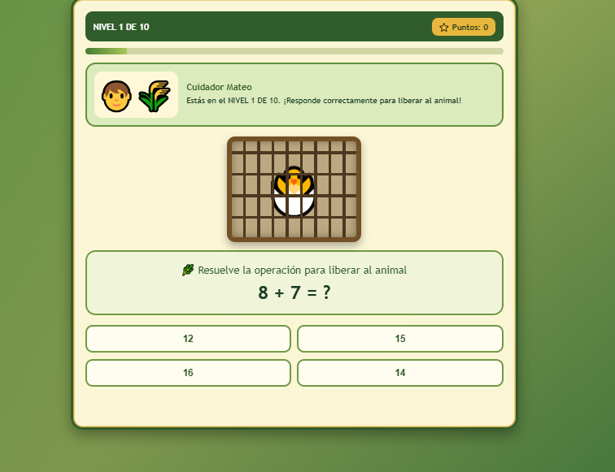
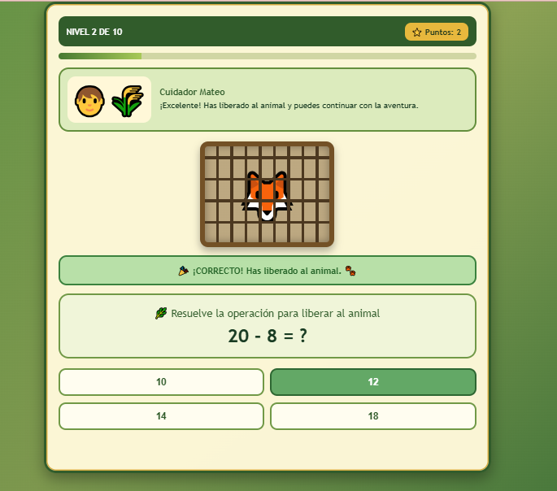

✦˚｡⋆ Zafimath Adventure ⋆｡˚✦

  ✦ Una aventura matemática por la selva ✦

˚｡⋆ ───────────────────────────── ⋆｡˚

✦ Sobre el juego

Zafimath Adventure es un videojuego educativo ambientado en una aventura por la selva.

El jugador acompaña al Cuidador Mateo y debe ayudar a liberar diferentes animales que se encuentran atrapados. Para conseguirlo, deberá resolver correctamente diferentes preguntas y operaciones matemáticas a lo largo de los niveles.

La experiencia combina aprendizaje, exploración y desafíos matemáticos dentro de una aventura interactiva.

˚｡⋆♡⋆｡˚

✦ Objetivo del jugador

Resolver correctamente los desafíos matemáticos para avanzar por los niveles y liberar a los animales atrapados.

El juego cuenta con 10 niveles y el progreso se representa mediante puntos y el avance de la aventura.

˚｡⋆♡⋆｡˚

✦ Mecánica principal

La mecánica principal consiste en:

✦ Elegir un animal para comenzar la aventura.

✦ Resolver una operación o pregunta matemática.

✦ Seleccionar una respuesta.

✦ Obtener puntos por las respuestas correctas.

✦ Avanzar progresivamente por los niveles.

✦ Completar los 10 niveles para finalizar la aventura.

˚｡⋆ ───────────────────────────── ⋆｡˚

✦ Género

Adventure · Puzzle · Educativo

˚｡⋆ ───────────────────────────── ⋆｡˚

✦ Controles

✦ CLICK — Seleccionar animales y respuestas.

✦ MOUSE — Interactuar con los elementos de la interfaz.

No requiere teclado para jugar.

˚｡⋆ ───────────────────────────── ⋆｡˚

✦ Capturas de pantalla

♡ Pantalla principal

  

♡ Gameplay

  

♡ Desafío matemático

  

˚｡⋆ ───────────────────────────── ⋆｡˚

✦ Tecnologías

HTML · CSS · JavaScript

˚｡⋆ ───────────────────────────── ⋆｡˚

✦ Jugar

<a href="https://aritozs673-maker.github.io/Game-Developer/juego-1-zafimath/">
✦ ♡ JUGAR ZAFIMATH ADVENTURE ♡ ✦
</a>

˚｡⋆ ✦ ⋆｡˚
