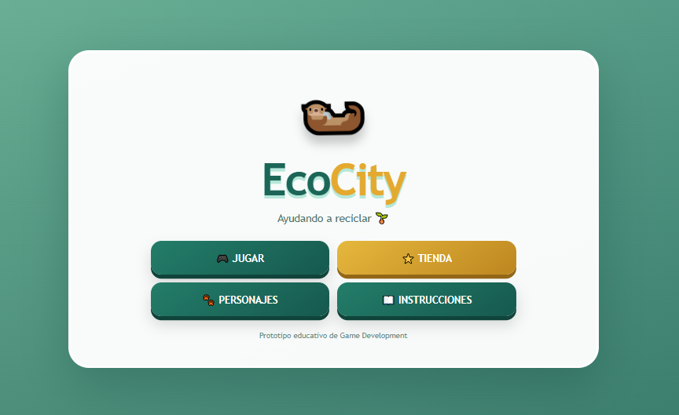
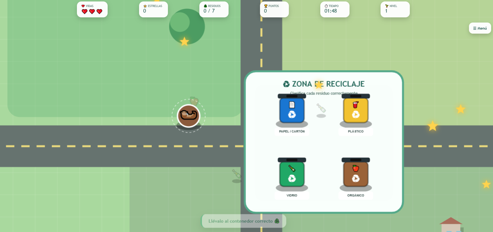
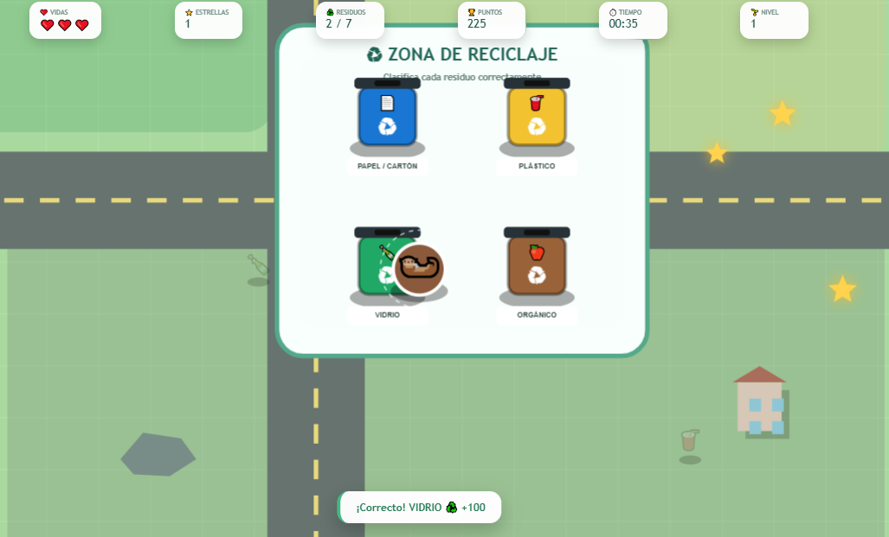

# ✦˚｡⋆ EcoCity ⋆｡˚✦

  ✦ Ayudando a reciclar ✦

˚｡⋆ ───────────────────────────── ⋆｡˚

## ✦ Sobre el juego

EcoCity es un videojuego educativo relacionado con el reciclaje y el cuidado del medio ambiente.

El jugador debe recorrer el mapa, recoger diferentes residuos y llevarlos al contenedor correspondiente. Durante el juego también puede obtener estrellas, utilizar personajes con diferentes habilidades y adquirir mejoras para facilitar su progreso.

La experiencia combina exploración, reciclaje, recolección y gestión de recursos dentro de una ciudad.

˚｡⋆♡⋆｡˚

## ✦ Objetivo del jugador

Limpiar completamente el mapa antes de que termine el tiempo, clasificando correctamente todos los residuos.

El jugador debe evitar errores de clasificación, ya que estos provocan la pérdida de vidas.

˚｡⋆♡⋆｡˚

## ✦ Mecánica principal

La mecánica principal consiste en recorrer el escenario y gestionar correctamente los residuos.

El jugador puede:

✦ Moverse por el mapa.

✦ Recoger residuos.

✦ Llevar cada residuo al contenedor correspondiente.

✦ Recoger estrellas.

✦ Desbloquear personajes.

✦ Comprar mejoras.

✦ Administrar las vidas disponibles.

✦ Completar el nivel antes de que termine el tiempo.

˚｡⋆ ───────────────────────────── ⋆｡˚

## ✦ Género

Arcade · Educativo · Aventura

˚｡⋆ ───────────────────────────── ⋆｡˚

## ✦ Controles

✦ W A S D — Mover al personaje.

✦ CLICK IZQUIERDO — Recoger un residuo cuando el personaje está cerca.

✦ INTERFAZ — Seleccionar personajes, mejoras y opciones de la tienda.

˚｡⋆ ───────────────────────────── ⋆｡˚

## ✦ Capturas de pantalla

### ♡ Pantalla principal

  

### ♡ Gameplay

  

### ♡ Clasificación de residuos

  

˚｡⋆ ───────────────────────────── ⋆｡˚

## ✦ Tecnologías

HTML · CSS · JavaScript

˚｡⋆ ───────────────────────────── ⋆｡˚

## ✦ Jugar

<a href="https://aritozs673-maker.github.io/Game-Developer/juego-2-ecocity/">
✦ ♡ JUGAR ECOCITY ♡ ✦
</a>

˚｡⋆ ✦ ⋆｡˚
