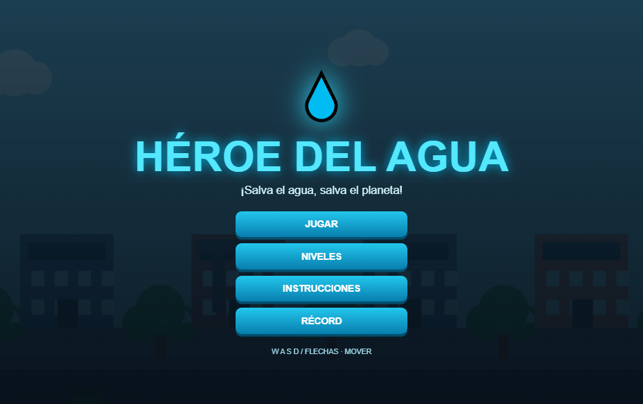
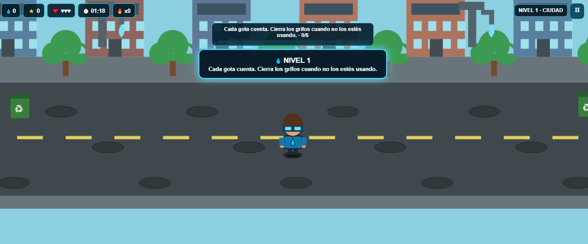
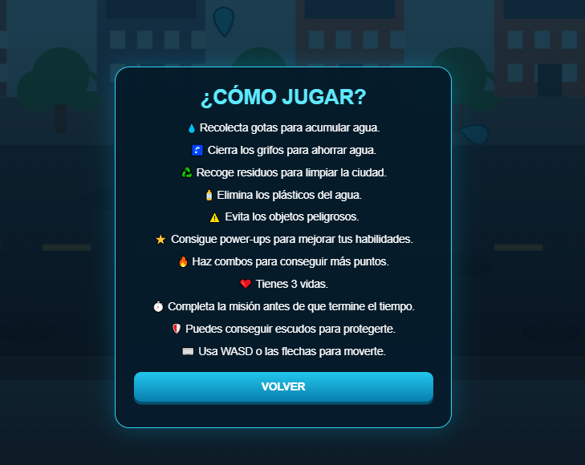

# ✦˚｡⋆ Héroe del Agua ⋆｡˚✦

  ✦ Salva el agua, salva el planeta ✦

˚｡⋆ ───────────────────────────── ⋆｡˚

## ✦ Sobre el juego

Héroe del Agua es un videojuego educativo de aventura y arcade en el que el jugador se convierte en un guardián encargado de proteger el agua y ayudar al planeta.

Durante las partidas, el jugador debe recolectar gotas de agua, cerrar grifos, recoger residuos, eliminar plásticos y evitar objetos peligrosos.

El juego cuenta con niveles progresivos, vidas, tiempo, puntos, combos y diferentes power-ups.

˚｡⋆♡⋆｡˚

## ✦ Objetivo del jugador

Completar las misiones de cada nivel antes de que termine el tiempo, manteniendo las vidas y acumulando puntos mediante acciones relacionadas con el cuidado del agua.

El jugador puede avanzar por diferentes niveles y mejorar sus resultados mediante puntos, combos y power-ups.

˚｡⋆♡⋆｡˚

## ✦ Mecánica principal

La mecánica principal consiste en recorrer el escenario y realizar diferentes acciones relacionadas con el cuidado del agua.

El jugador debe:

✦ Recolectar gotas de agua.

✦ Cerrar los grifos.

✦ Recoger residuos.

✦ Eliminar plásticos del agua.

✦ Evitar objetos peligrosos.

✦ Conseguir power-ups.

✦ Crear combos para obtener más puntos.

✦ Administrar las 3 vidas disponibles.

✦ Completar las misiones antes de que termine el tiempo.

Además, existe un centro de ayuda donde se pueden utilizar recursos para obtener diferentes ventajas.

˚｡⋆ ───────────────────────────── ⋆｡˚

## ✦ Género

Arcade · Adventure · Educativo

˚｡⋆ ───────────────────────────── ⋆｡˚

## ✦ Controles

✦ W — Mover hacia arriba.

✦ A — Mover hacia la izquierda.

✦ S — Mover hacia abajo.

✦ D — Mover hacia la derecha.

✦ FLECHAS — También permiten mover al personaje.

✦ CLICK — Interactuar con botones y elementos de la interfaz.

˚｡⋆ ───────────────────────────── ⋆｡˚

## ✦ Capturas de pantalla

### ♡ Pantalla principal

  

### ♡ Gameplay

  

### ♡ Centro de ayuda

  

˚｡⋆ ───────────────────────────── ⋆｡˚

## ✦ Player Persona

El diseño del videojuego fue planteado considerando un Player Persona dirigido a jóvenes de 18 a 25 años.

La propuesta busca utilizar una experiencia dinámica, retos, puntos, combos, récords y progresión para promover el ahorro y cuidado responsable del agua sin recurrir únicamente a mensajes tradicionales.

˚｡⋆ ───────────────────────────── ⋆｡˚

## ✦ Tecnologías

HTML · CSS · JavaScript

˚｡⋆ ───────────────────────────── ⋆｡˚

## ✦ Jugar

<a href="https://aritozs673-maker.github.io/Game-Developer/juego-4-heroe-del-agua/">
✦ ♡ JUGAR HÉROE DEL AGUA ♡ ✦
</a>

˚｡⋆ ✦ ⋆｡˚
