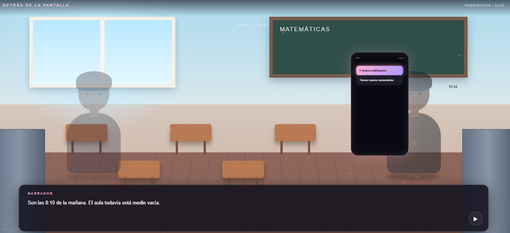
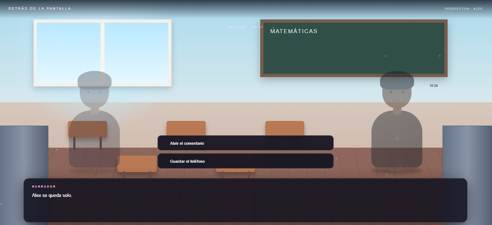
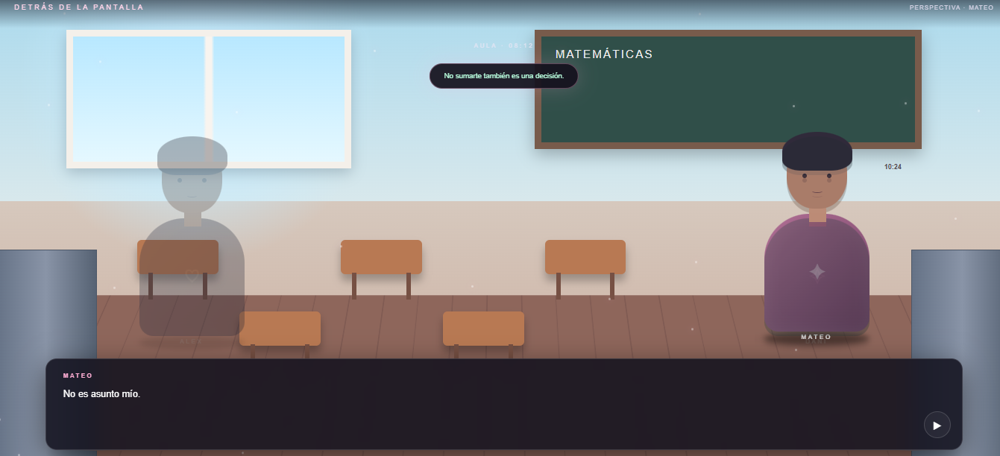

# ✦˚｡⋆ Detrás de la Pantalla ⋆｡˚✦

  ✦ Una historia de decisiones detrás del mundo digital ✦

˚｡⋆ ───────────────────────────── ⋆｡˚

## ✦ Sobre el juego

Detrás de la Pantalla es un videojuego narrativo y de toma de decisiones basado en situaciones relacionadas con el cyberbullying y las interacciones dentro de los entornos digitales.

El jugador acompaña a los personajes a través de diferentes escenas y situaciones, observando conversaciones, mensajes y acontecimientos que forman parte de la historia.

La experiencia busca presentar diferentes perspectivas y permitir que el jugador avance mediante sus decisiones.

˚｡⋆♡⋆｡˚

## ✦ Objetivo del jugador

Avanzar por la historia y tomar decisiones frente a las diferentes situaciones que aparecen durante la experiencia.

El jugador debe observar el contexto de cada situación y seleccionar las opciones disponibles para continuar la historia.

˚｡⋆♡⋆｡˚

## ✦ Mecánica principal

La mecánica principal está basada en la narrativa interactiva y la toma de decisiones.

El jugador debe:

✦ Observar las escenas.

✦ Leer los diálogos.

✦ Revisar las situaciones presentadas.

✦ Interactuar con los elementos de la historia.

✦ Seleccionar las decisiones disponibles.

✦ Continuar la narrativa según las acciones realizadas.

˚｡⋆ ───────────────────────────── ⋆｡˚

## ✦ Género

RPG · Adventure · Narrativo

˚｡⋆ ───────────────────────────── ⋆｡˚

## ✦ Controles

✦ CLICK — Interactuar con la historia.

✦ CLICK — Seleccionar las opciones disponibles.

✦ BOTÓN DE CONTINUAR — Avanzar dentro de las escenas.

El juego está diseñado principalmente para interacción mediante mouse.

˚｡⋆ ───────────────────────────── ⋆｡˚

## ✦ Capturas de pantalla

### ♡ Pantalla inicial

  

### ♡ Escena narrativa

  

### ♡ Decisiones

  

˚｡⋆ ───────────────────────────── ⋆｡˚

## ✦ Tecnologías

HTML · CSS · JavaScript

˚｡⋆ ───────────────────────────── ⋆｡˚

## ✦ Jugar

<a href="https://aritozs673-maker.github.io/Game-Developer/juego-5-cyberbullying/">
✦ ♡ JUGAR DETRÁS DE LA PANTALLA ♡ ✦
</a>

˚｡⋆ ✦ ⋆｡˚
