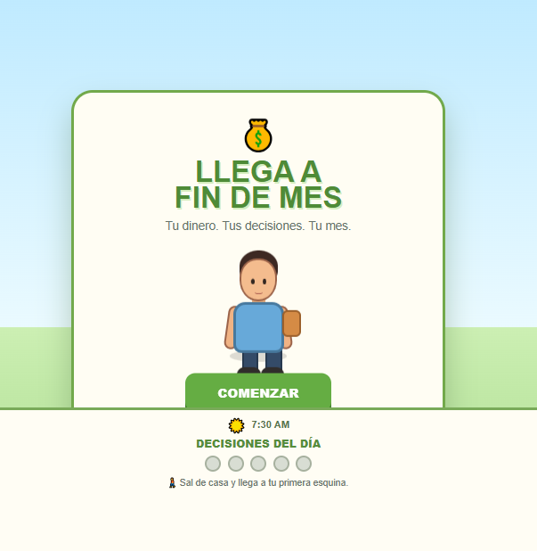
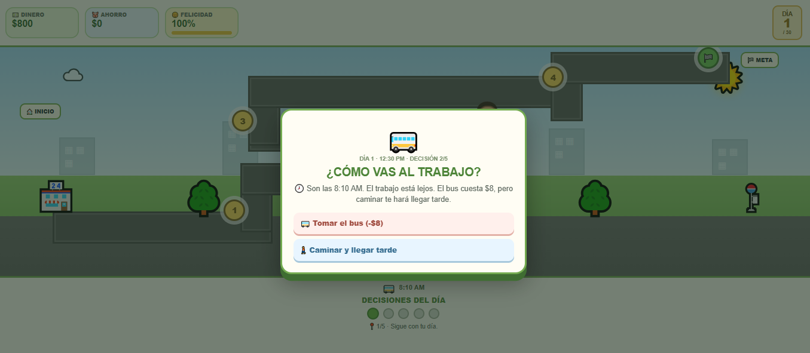
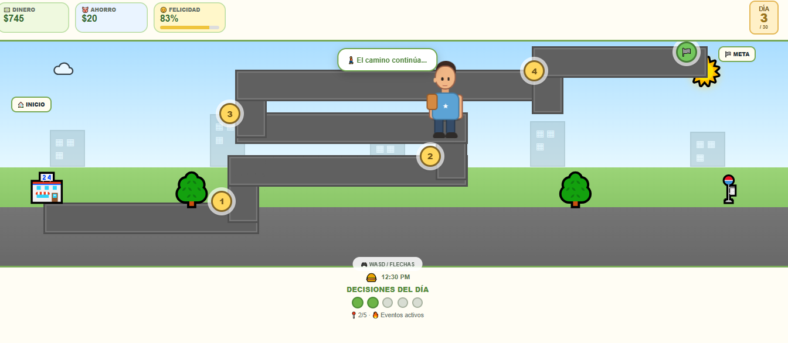

# ✦˚｡⋆ Llega a Fin de Mes ⋆｡˚✦

  ✦ Tu dinero · Tus decisiones · Tu mes ✦

˚｡⋆ ───────────────────────────── ⋆｡˚

## ✦ Sobre el juego

Llega a Fin de Mes es un videojuego de simulación y toma de decisiones relacionado con la administración del dinero.

El jugador comienza el mes con una cantidad determinada de dinero y debe tomar diferentes decisiones a lo largo de los días para intentar llegar hasta el día 30 administrando correctamente sus recursos.

Durante el recorrido aparecen situaciones y decisiones que pueden afectar diferentes aspectos del jugador, como el dinero, el ahorro y la felicidad.

˚｡⋆♡⋆｡˚

## ✦ Objetivo del jugador

Llegar hasta el día 30 administrando correctamente el dinero y tomando decisiones durante el transcurso del mes.

El jugador debe intentar equilibrar sus recursos y tomar decisiones que le permitan avanzar sin quedarse sin dinero.

˚｡⋆♡⋆｡˚

## ✦ Mecánica principal

La mecánica principal combina exploración, movimiento y toma de decisiones.

El jugador debe:

✦ Recorrer el escenario.

✦ Avanzar por diferentes ubicaciones.

✦ Encontrar las situaciones del día.

✦ Tomar decisiones.

✦ Administrar el dinero disponible.

✦ Intentar aumentar sus ahorros.

✦ Mantener un nivel adecuado de felicidad.

✦ Enfrentar eventos que pueden aparecer durante el mes.

✦ Llegar hasta el día 30.

˚｡⋆ ───────────────────────────── ⋆｡˚

## ✦ Género

Strategy · Simulation · Educational

˚｡⋆ ───────────────────────────── ⋆｡˚

## ✦ Controles

✦ W — Mover hacia arriba.

✦ A — Mover hacia la izquierda.

✦ S — Mover hacia abajo.

✦ D — Mover hacia la derecha.

✦ FLECHAS — También permiten desplazarse.

✦ CLICK — Seleccionar decisiones y opciones.

˚｡⋆ ───────────────────────────── ⋆｡˚

## ✦ Capturas de pantalla

### ♡ Pantalla principal

  

### ♡ Gameplay

  

### ♡ Decisiones del día

  

### ♡ Estado del jugador

  

˚｡⋆ ───────────────────────────── ⋆｡˚

## ✦ Tecnologías

HTML · CSS · JavaScript

˚｡⋆ ───────────────────────────── ⋆｡˚

## ✦ Jugar

<a href="https://aritozs673-maker.github.io/Game-Developer/juego-6-fin-de-mes/">
✦ ♡ JUGAR LLEGA A FIN DE MES ♡ ✦
</a>

˚｡⋆ ✦ ⋆｡˚
